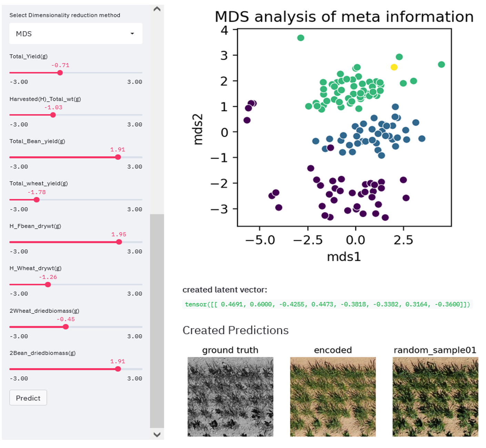

# Latent GAN

<!-- PROJECT SHIELDS -->
<!--
*** https://www.markdownguide.org/basic-syntax/#reference-style-links
-->
[![Contributors][contributors-shield]][contributors-url]
[![MIT License][license-shield]][license-url]

<!-- PROJECT LOGO -->
 

  <h3 align="center">Latent GAN</h3>
  

    Predict plant growth with Generative Adversarial Neural Networks
     
     
  

<!-- TABLE OF CONTENTS -->

  
Table of Contents

  <ol>
    <li>
      <a href="#about-the-project">About The Project</a>
      <ul>
      <li><a href="#Example Results">Example Results</a></li>
      </ul>
    </li>
    </li>
    <li>
      <a href="#getting-started">Getting Started</a>
      <ul>
        <li><a href="#prerequisites">Prerequisites</a></li>
        <li><a href="#installation">Installation</a></li>
      </ul>
    </li>
    <li>
      <a href="#usage">Usage</a></li>
    <ul>
      <li><a href="#click">click</a></li>
      <li><a href="#web">web application</a></li>
    </ul>  
    <li><a href="#contributing">Contributing</a></li>
    <li><a href="#license">License</a></li>
    <li><a href="#contact">Contact</a></li>
    <li><a href="#acknowledgements">Acknowledgements</a></li>
  </ol>

## About The Project
Declining yields and fluctuating climatic conditions are one of the major concerns of modern agriculture. Simoultaniously, the decline in arable land posesan additional contraint. Mixed crops are expected to increase biodiversity and yields while reducing the risk of crop failure. Research is currently focusing intensively on how mixtures develop as a function of underlying factors such as variety, seed density or the mixture ratio sown. Predicting the development of mixtures based on diverse data is one of the unsolved tasks in this field.
The objective of this work is to implement and assess a multiconditional GAN for plant growth prediction in mixed crop environments. The work is based on RGB and multispectral image data as well as non-image  data  such  as  varieties,  sowingdensity and environmental conditions. The integration of these - non-imagebased - parameters as additional constraints in a cGAN is an unsolved challengeand subject of research. The available data, collected at regular intervals, forma time series that captures the development of mixtures. The data comes from the PhenoRob cluster of excellence.

<!-- EXAMPLE RESULTS -->
## Example Results
  

<!-- Usage -->
## Usage
A Streamlit application can be used to predict plant growth by using individualized parameters.
  

<!-- CONTRIBUTING -->
## Contributing
Contributions are **greatly appreciated**.

1. Fork the Project
2. Create your Feature Branch (`git checkout -b feature/AmazingFeature`)
3. Commit your Changes (`git commit -m 'Add some AmazingFeature'`)
4. Push to the Branch (`git push origin feature/AmazingFeature`)
5. Open a Pull Request

<!-- LICENSE -->
## License
Distributed under the MIT License. See `LICENSE` for more information.

<!-- CONTACT -->
## Contact
* Miro Miranda Lorenz - s0mimira@uni-bonn.de

## Authors
* [**Miro Miranda Lorenz**](https://github.com/Mirindi95)

<!-- MARKDOWN LINKS & IMAGES -->
<!-- https://www.markdownguide.org/basic-syntax/#reference-style-links -->
[contributors-shield]: https://img.shields.io/github/contributors/othneildrew/Best-README-Template.svg?style=for-the-badge
[contributors-url]: https://github.com/Mirindi95/Latent-GAN/graphs/contributors
[license-shield]: https://img.shields.io/github/license/othneildrew/Best-README-Template.svg?style=for-the-badge
[license-url]: https://github.com/othneildrew/Best-README-Template/blob/master/LICENSE.txt

